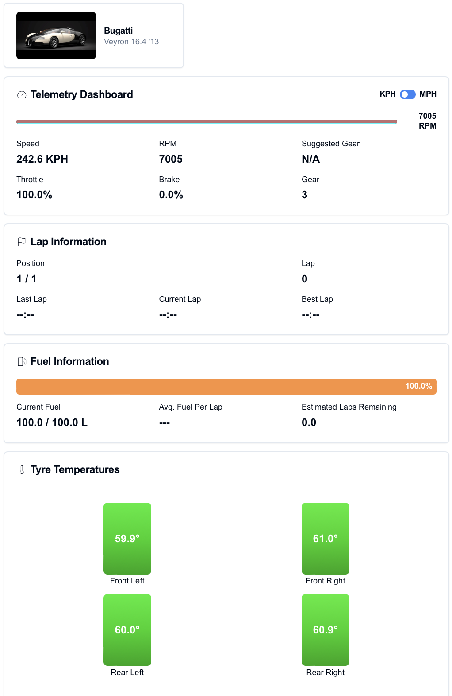
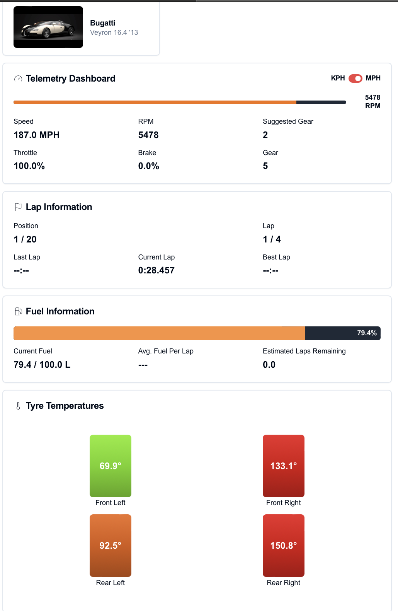

# GT7 Web Telemetry

Real-time telemetry dashboard for Gran Turismo 7 using WebSocket, Python and React.
Still very much work in progress! As of 1/5/2025, a basic dashboard has been implemented, more to come!

## Some Stills:

 

## Features

- Real-time telemetry data visualization
- Web-based dashboard accessible via browser
- Support for Gran Turismo 7 on PS4/PS5
- Responsive design for all screen sizes

## Tech Stack

- **Frontend**: Next.js, React, TypeScript, TailwindCSS, shadcn/ui
- **Backend**: Python, FastAPI, WebSocket
- **Protocol**: UDP with Salsa20 encryption

## Prerequisites

- Node.js 18+
- Python 3.8+
- Gran Turismo 7 on PS4/PS5
- Network connection to PlayStation
- Device on same network as the PlayStation

## Setup

1. Clone repository:
```bash
git clone https://github.com/Mahir-2003/turismo-telemetry.git
cd turismo-telemetry
```

2. Install frontend dependencies:
```bash
npm install
```

3. Install backend dependencies:
```bash
pip install -r backend/requirements.txt
```

4. Start development servers:
```bash
# Frontend
cd frontend
npm run dev

# On a seperate terminal
# Backend
cd backend
python main.py
```

5. Open browser and navigate to `http://localhost:3000`

## Usage

1. Launch Gran Turismo 7 and start a race
3. Enter PlayStation IP address in dashboard
4. Connect and view real-time telemetry

## Finding Your PlayStation IP Address
1. On your PlayStation:
  - Go to Settings
  - Select 'Network'
  - Select 'View Connection Settings'
  - Note the IPv4 Address

## Development

- `npm run dev`: Start frontend development server
- `npm run build`: Build production frontend
- `npm run test`: Run tests
- `python backend/main.py`: Start backend server

## Contributing

1. Fork repository
2. Create feature branch
3. Commit changes
4. Push to branch
5. Submit pull request

## License

MIT License - See LICENSE file for details

## Acknowledgments

Based on:
- [Original GT7 Python telemetry implementation](https://github.com/Bornhall/gt7telemetry) by Bornhall
- [GT7 Dashboard](https://github.com/snipem/gt7dashboard) by snipem
- [GT7 Simulator Interface](https://github.com/Nenkai/PDTools/tree/master) by Nenkai (Specifically `PDTools.SimulatorInterface`)
