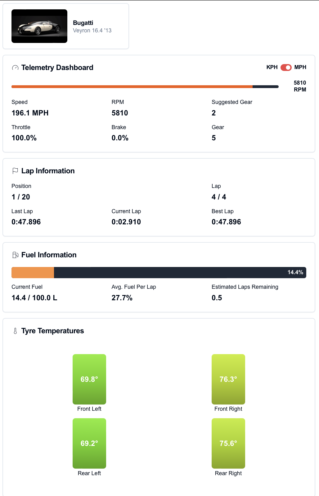

<p align="center">
  
</p>

# Turismo Telemetry for Gran Turismo 7

A real-time telemetry dashboard for Gran Turismo 7, featuring multiple display modes. Built with Next.js, React, FastAPI, and TypeScript.

## Demonstration Video

Watch a [demonstration video](https://youtu.be/nR9Hvjo_gmk) of Turismo Telemetry in action!

## Screenshots



## Features

### Display Modes
- **Advanced Display** - Comprehensive view with circular gauges, advanced RPM gauge, and detailed charts
- **Standard Display** - Balanced view with RPM bar, circular gauges, and history graphs
- **Compact Display** - Minimal view optimized for mobile and small screens
- **Basic Display** - Original telemetry display with essential metrics

### Real-time Telemetry Data
- **Engine Metrics**: RPM, oil pressure, oil temperature, water temperature
- **Speed**: Current speed (mph/kmh)
- **Tire Data**: Individual tire temperatures and surface temperatures
- **Fuel System**: Fuel level, capacity, per-lap consumption tracking
- **Transmission**: Current gear, suggested gear, RPM after shift
- **Race Information**: Current lap, lap times, race position, total laps
- **Car Information**: Automatic car identification with name, manufacturer, and image

## Tech Stack

- **Frontend**: Next.js, React, TypeScript, TailwindCSS, shadcn/ui, Recharts
- **Backend**: FastAPI (Python), Uvicorn, WebSockets, Salsa20 encryption
- **Communication**: UDP + WebSocket with binary struct parsing

## Prerequisites

- **Node.js** 18 or higher
- **Python** 3.8 or higher
- **Gran Turismo 7** on PS4/PS5
- **Network**: Device on same network as PlayStation

## Installation & Setup

### 1. Clone the Repository
```bash
git clone https://github.com/Mahir-2003/turismo-telemetry.git
cd turismo-telemetry
```

### 2. Frontend Setup
```bash
cd frontend
npm install
```

### 3. Backend Setup
```bash
cd backend
pip install -r requirements.txt
```

### 4. Start Development Servers

**Terminal 1 - Backend:**
```bash
cd backend
python main.py
```
The backend will start on `http://localhost:8000`

**Terminal 2 - Frontend:**
```bash
cd frontend
npm run dev
```
The frontend will start on `http://localhost:3000`

### 5. Open Dashboard
Navigate to `http://localhost:3000` in your browser

## Usage

### Connecting to PlayStation

1. **Find Your PlayStation IP Address**:
   - On your PlayStation, go to: **Settings → Network → View Connection Settings**
   - Note the **IPv4 Address** (e.g., 192.168.1.100)

2. **Launch Gran Turismo 7**:
   - Start any driving session (race, time trial, etc.)

3. **Connect in Dashboard**:
   - Enter your PlayStation's IP address in the connection form
   - Click **Connect**
   - Telemetry data will begin streaming in real-time

### Project Structure
```
turismo-telemetry/
├── frontend/              # Next.js application
│   ├── src/
│   │   ├── app/          
│   │   ├── components/   
│   │   ├── lib/          # utilities
│   │   ├── types/        # type definitions
│   │   └── context/      
│   └── package.json
├── backend/              # Python FastAPI server
│   ├── telemetry/        # core telemetry system
│   │   ├── reader.py     # udp communication
│   │   ├── parser.py     # binary packet parsing
│   │   ├── models.py     # pydantic data models
│   │   ├── fuel_monitor.py
│   │   └── data/         # car database
│   ├── app_config/       
│   ├── tests/            
│   ├── main.py           # FastAPI application entry point
│   └── requirements.txt
├── docs/                 
├── assets/               # Logo and branding
└── README.md
```

## Troubleshooting

### Connection Issues
- Ensure PlayStation and computer are on the same network
- Verify IP address is correct
- Check that Gran Turismo 7 is actively running (in a session)
- Confirm firewall isn't blocking UDP ports 33739/33740

### Backend Not Starting
- Verify Python 3.8+ is installed: `python --version`
- Ensure all dependencies are installed: `pip install -r backend/requirements.txt`
- Check that port 8000 is not in use

## Contributing

Contributions are welcome! Please follow these steps:

1. Fork the repository
2. Create a feature branch (`git checkout -b feature/amazing-feature`)
3. Commit your changes (`git commit -m 'Add amazing feature'`)
4. Push to the branch (`git push origin feature/amazing-feature`)
5. Open a Pull Request

## License

This project is licensed under the MIT License - see the [LICENSE](LICENSE) file for details.

## Acknowledgments

This project builds upon the work of:
- [Bornhall/gt7telemetry](https://github.com/Bornhall/gt7telemetry) - Original GT7 Python telemetry implementation
- [snipem/gt7dashboard](https://github.com/snipem/gt7dashboard) - GT7 Dashboard inspiration
- [Nenkai/PDTools](https://github.com/Nenkai/PDTools/tree/master) - GT7 Simulator Interface documentation (SimulatorInterface)

---

**Note**: This project is not affiliated with or endorsed by Polyphony Digital or Sony Interactive Entertainment.
